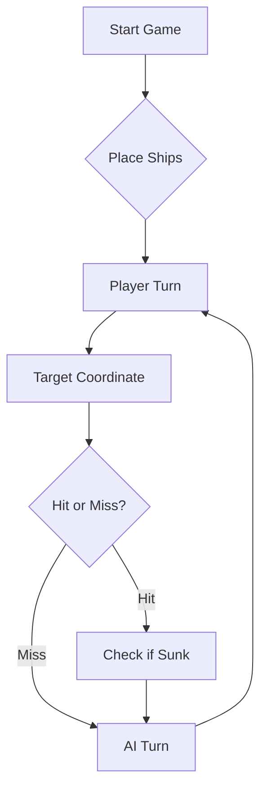

# ⚓ Battleship 2.0

Grupo TP06-11
LEI Pedro Angelno 99371
IGE Gonçalo Nunes 100678
IGE Martim Saldanha 111245

# Youtube Demonstration Video: 
https://www.youtube.com/watch?v=3r4T6BXICqQ
# Youtube Local LLM Demo: 
https://youtu.be/L9qyg9Gvlz4


> A modern take on the classic naval warfare game, designed for the XVII century setting with updated software engineering patterns.

## Documentação do Projeto

Consulta a [documentação completa do <nome_projeto>](https://<o_teu_username>.github.io/<nome_repositorio>/) gerada automaticamente com Javadoc.

# Prompt Used to Communicate with ChatGPT - Improved Version [D.2]

## REGRAS DE DECISÃO

### 1. Diário de Bordo (Memória Obrigatória)

Mantém um registo completo e cumulativo de todas as jogadas.

**Formato obrigatório:**

Rajada X:
- Coordenada → Resultado

- Nunca percas histórico.
- Usa o diário para inferência (não apenas registo).

---

### 2. Validação de tiros

- Nunca dispares fora do tabuleiro.
- Nunca repitas coordenadas.
- Cada rajada deve conter exatamente 3 tiros.

**Exceção:**

- Podes repetir coordenadas apenas na última jogada, se necessário para completar 3 tiros.

---

### 3. Modelo Mental do Tabuleiro

Mantém internamente:

- Conjunto de posições testadas
- Conjunto de posições inválidas (halo)
- Conjunto de alvos ativos (navios parcialmente descobertos)
- Probabilidade implícita das posições restantes

---

### 4. Estratégia Base (Modo Procura)

Quando não há alvos ativos:

- Usa padrão tipo **checkerboard (xadrez)** para maximizar eficiência:
   - Só dispara em casas alternadas.
- Garante espaçamento mínimo entre tiros.

**Evita:**
- Posições adjacentes a água confirmada irrelevante
- Diagonais de tiros certeiros (exceto se suspeita de Galeão)

---

### 5. Estratégia de Ataque (Modo Caça)

Ao acertar num navio:

#### 5.1 Primeira confirmação
Testa imediatamente:
- Norte
- Sul
- Este
- Oeste

#### 5.2 Direção identificada
Quando existirem 2 acertos alinhados:
→ Define direção do navio  
→ Continua nessa direção até:
- Afundar
- Ou falhar → inverter direção

#### 5.3 Otimização
- Nunca dispersar tiros enquanto há um navio por terminar
- Prioridade total ao alvo ativo

---

### 6. Navio Afundado (Regra Crítica)

Quando um navio é afundado:

1. Identifica todas as coordenadas do navio
2. Marca automaticamente todas as posições adjacentes (halo) como:
   → ÁGUA
3. Adiciona essas posições ao conjunto de exclusão
4. Nunca mais dispares nessas posições

---

### 7. Gestão de Múltiplos Alvos

- Se existirem múltiplos navios parcialmente descobertos:
   - Prioriza o que tem maior número de acertos consecutivos
   - Evita alternar sem necessidade

---

### 8. Eficiência e Inferência

- Usa o tamanho mínimo dos navios restantes para eliminar posições impossíveis
- Evita tiros isolados que não comportam nenhum navio restante
- Maximiza interseção de possibilidades

---

##  FORMATO DE RESPOSTA (OBRIGATÓRIO)

Rajada X:  
Tiros: A1, B2, C3

Resultados:  
A1 → Água  
B2 → Nau atingida  
C3 → Água

Diário de Bordo:  
Rajada 1:
- A1 → Água
- B2 → Nau atingida
- C3 → Água  
  [...]

Análise:  
[Explica o raciocínio estratégico com base no estado atual]

Próxima jogada:  
Tiros: D2, B3, B1  
[Justificação clara baseada na estratégia]
"""


## 📖 Table of Contents
- [Project Overview](#-project-overview)
- [Key Features](#-key-features)
- [Technical Stack](#-technical-stack)
- [Installation & Setup](#-installation--setup)
- [Code Architecture](#-code-architecture)
- [Roadmap](#-roadmap)
- [Contributing](#-contributing)

---

## 🎯 Project Overview
This project serves as a template and reference for students learning **Object-Oriented Programming (OOP)** and **Software Quality**. It simulates a battleship environment where players must strategically place ships and sink the enemy fleet.

### 🎮 The Rules
The game is played on a grid (typically 10x10). The coordinate system is defined as:

$$(x, y) \in \{0, \dots, 9\} \times \{0, \dots, 9\}$$

Hits are calculated based on the intersection of the shot vector and the ship's bounding box.

---

## ✨ Key Features
| Feature | Description | Status |
| :--- | :--- | :---: |
| **Grid System** | Flexible $N \times N$ board generation. | ✅ |
| **Ship Varieties** | Galleons, Frigates, and Brigantines (XVII Century theme). | ✅ |
| **AI Opponent** | Heuristic-based targeting system. | 🚧 |
| **Network Play** | Socket-based multiplayer. | ❌ |

---

## 🛠 Technical Stack
* **Language:** Java 17
* **Build Tool:** Maven / Gradle
* **Testing:** JUnit 5
* **Logging:** Log4j2

---

## 🚀 Installation & Setup

### Prerequisites
* JDK 17 or higher
* Git

### Step-by-Step
1. **Clone the repository:**
   ```bash
   git clone [https://github.com/britoeabreu/Battleship2.git](https://github.com/britoeabreu/Battleship2.git)
   ```
2. **Navigate to directory:**
   ```bash
   cd Battleship2
   ```
3. **Compile and Run:**
   ```bash
   javac Main.java && java Main
   ```

---

## 📚 Documentation

You can access the generated Javadoc here:

👉 [Battleship2 API Documentation](https://britoeabreu.github.io/Battleship2/)


### Core Logic
```java
public class Ship {
    private String name;
    private int size;
    private boolean isSunk;

    // TODO: Implement damage logic
    public void hit() {
        // Implementation here
    }
}
```

### Design Patterns Used:
- **Strategy Pattern:** For different AI difficulty levels.
- **Observer Pattern:** To update the UI when a ship is hit.
</details>

### Logic Flow


---

## 🗺 Roadmap
- [x] Basic grid implementation
- [x] Ship placement validation
- [ ] Add sound effects (SFX)
- [ ] Implement "Fog of War" mechanic
- [ ] **Multiplayer Integration** (High Priority)

---

## LLM
- Used Ollama with llama3:8b-instruct_q4_0 model.
---


## 🧪 Testing
We use high-coverage unit testing to ensure game stability. Run tests using:
```bash
mvn test
```

> [!TIP]
> Use the `-Dtest=ClassName` flag to run specific test suites during development.

---

## 🤝 Contributing
Contributions are what make the open-source community such an amazing place to learn, inspire, and create.

1. Fork the Project
2. Create your Feature Branch (`git checkout -b feature/AmazingFeature`)
3. Commit your Changes (`git commit -m 'Add some AmazingFeature'`)
4. Push to the Branch (`git push origin feature/AmazingFeature`)
5. Open a **Pull Request**

---

## 📄 License
Distributed under the MIT License. See `LICENSE` for more information.

---
**Maintained by:** [@britoeabreu](https://github.com/britoeabreu)  
*Created for the Software Engineering students at ISCTE-IUL.*
